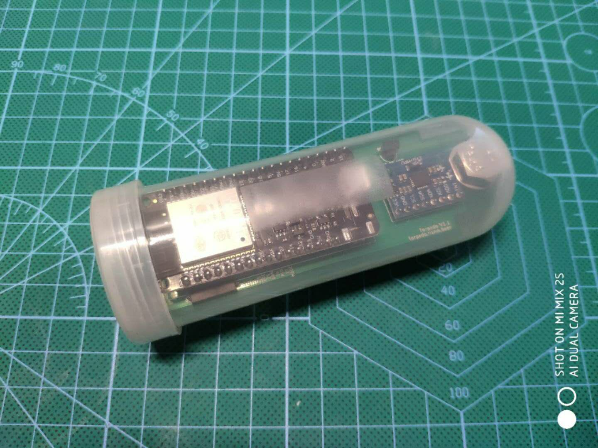
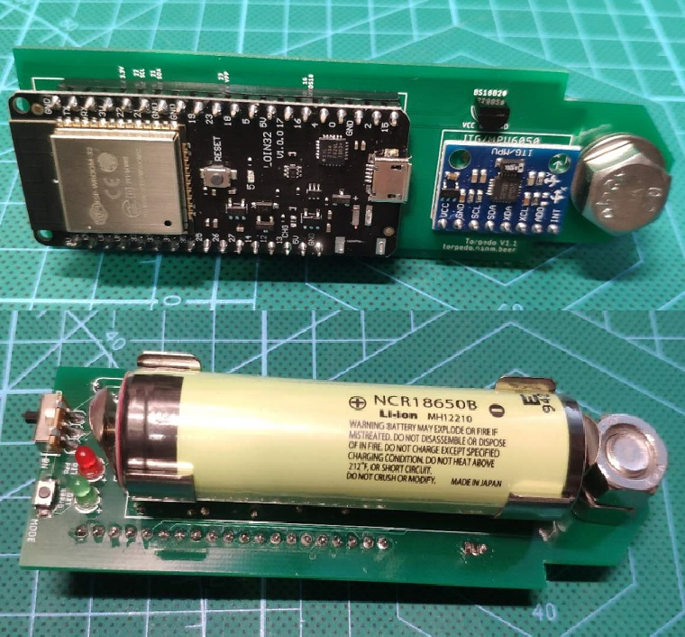
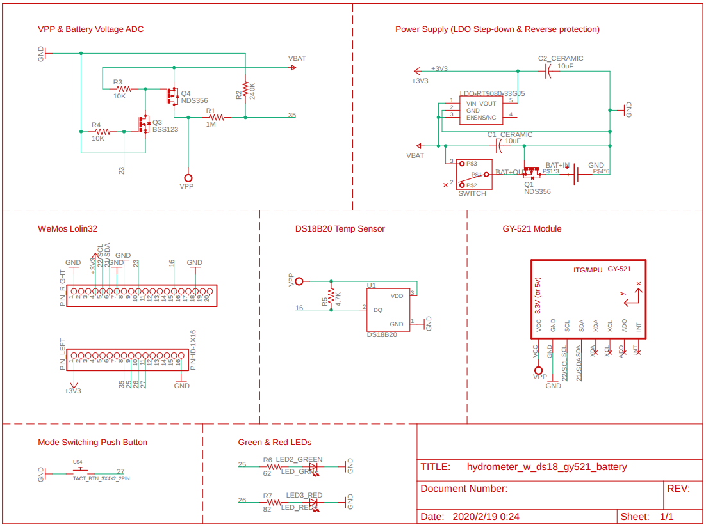
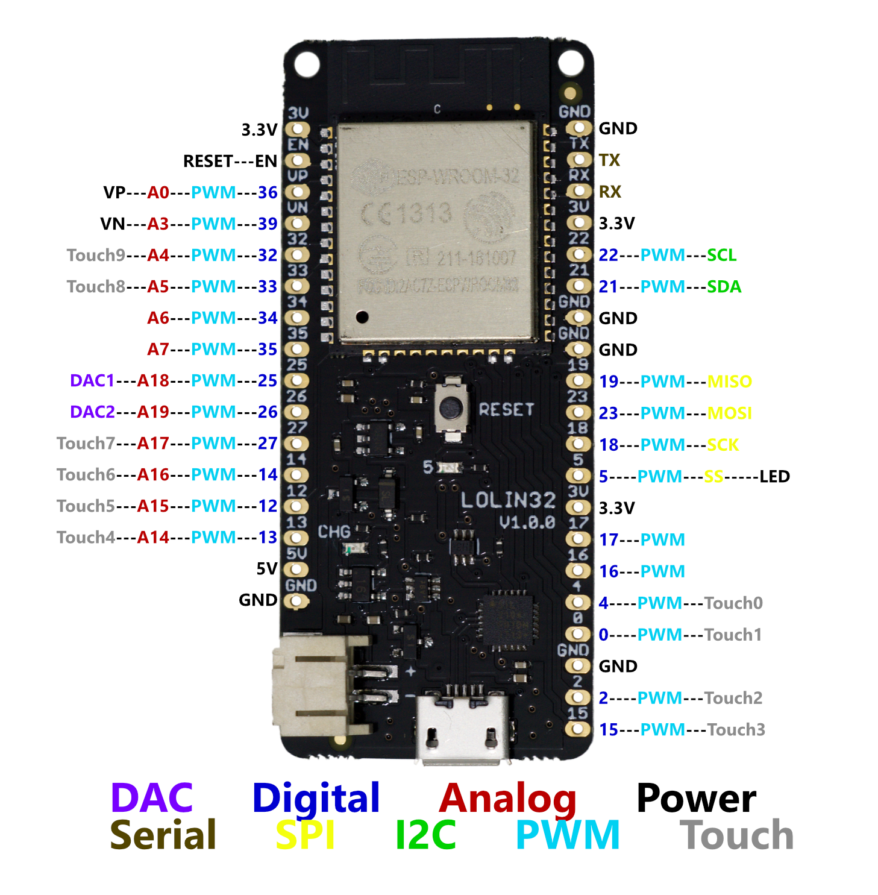
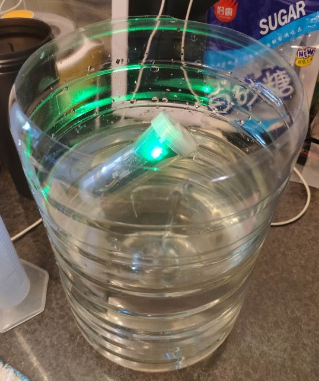
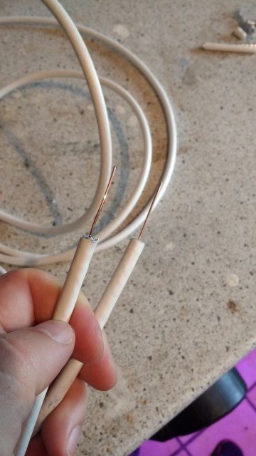
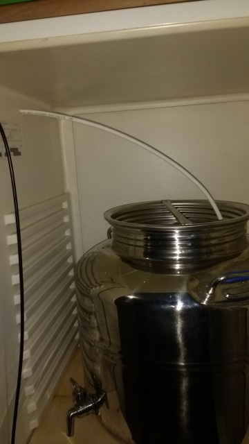
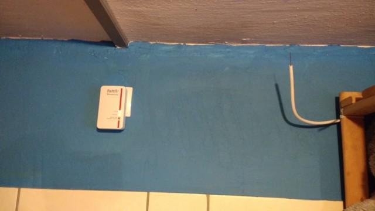

# Hydrometer-Esp32-Micropython

### Codename: Torpedo
A digital wireless hydrometer inspired by Tilt & iSpindel.

Powered by MicroPython ESP32.





---
### Features
- This hydrometer is self-contained, which means you can do the calibration without for example a spread sheet.
  The polynomial regression for the plato/sg tilt angle relationship is already built into the front-end.
  So just follow the guide and you can do the calibration easily.
  The calibration even has a temperature correction feature which is optional, so that the calibration is still
  valid even if your tap water is really cold or warm.
- Gravity/Plato data can be optionally sent to either a fermentation controller, e.g. CraftBeerPi3
  or a MQTT broker (e.g. Ubidots).
- The API is compatible with CraftBeerPi3 out of the box (also be sure to check out my Fermenter-ESP32-Micropython project,
  and it can be a drop-in replacement for iSpindel.
- The API can be customized to be compatible with your own fermenter controller.
- Measurements to be sent via the API: specific gravity, plato, temperature in both Celsius and Fahrenheit, tilt angel,
  battery voltage etc.
  No extra calculation required.
- Like the Tilt or the iSpindel, it has a DS18B20 temp sensor to measure 'the wort temperature' which can be a reference
  for those brewers who don't have a temp sensor measuring the wort temp directly.
- The battery level will be indicated by the LED color upon switching on - green means the battery is healthy
  while red means the power may not be enough to support the whole fermentation process.
---

### Bill of Materials
** Just for reference as this is no hardware building guide.
- [x] 1 x **ESP32 dev board**.  In theory, any ESP32 dev board will work, but considering the deep-sleep power consumption,
 the Wemos Lolin 32 or the DFRobot FireBeetle is recommended.  The code in this branch is for Wemos Lolin 32.
- [x] 1 x MPU6050 break-out board, e.g. **GY-521**.  It communicates with the ESP32 via I2C bus.
- [x] 1 x **DS18B20** temperature sensor.
- [x] 2 x **3mm LEDs** in green & red.
- [X] 1 x swtich, either SPDT (Single-Pole Double-Throw) or SPST (Single-Pole Single Throw) will do.
- [x] Some resistors (depending on how your hardware build).  E.g. 4.7K x 1 for the DS18B20; 62Ω x 1 for the green led;
 82Ω x 1 for the red; Voltage divider for battery voltage measurement, e.g. 240K x 1 & 1M x 1.
- [x] 1 x **LDO (Low Drop Out regulator)**. It's recommended to power up the ESP32 board with an LDO via one of the 3.3v pins
 to optimize power consumption.  E.g. RT9080, also make sure output voltage of the LDO is 3.3v.
- [x] It's also recommended to use a Mosfet to control the power supply to the DS18B20 and the GY-521, so that during
 the deep-sleep and power can be turn off the DS18B20 and the GY-521 to maximize the battery life span.
- [x] 1 x **18650 rechargeable lipo battery** (better with a built-in protection circuit).  This project doesn't
 incorporate a charging module.  The battery is charged with an external charger.  It's recommended to have a second
 battery as a backup, so that you don't have to wait for the recharging - simply swap the battery and you are good to go.
- [x] 1 x **plastic tube** to hold the above hardware.  The tube will be in direct contact with the wort, so the material
 should be food safe.  Also it's suggested avoid using a tube with the metal lid as metal blocks the WiFi signal.
---

### Wiring
* Below is the schematic of how I wire the parts and modules, along with the pin-out of the Lolin32 dev board.
#### Schematic

#### WeMos Lolin32 Pin-out


---
### User Guide
#### Installation
* Downloading and flashing the firmware, pls see [here](http://micropython.org/download#esp32)
* Uploading file ```uftpd.py``` to ESP32, pls see the [tutorial](https://techtutorialsx.com/2017/06/04/esp32-esp8266-micropython-uploading-files-to-the-file-system/)
* Connecting ESP32 via SSH, and establish an FTP connection:
    ```python
    import network
    sta = network.WLAN(network.STA_IF)
    sta.active(True)
    sta.connect('WIFI_SSID', 'WIFI_PASSWORD')  # replace the strings with your own wifi ssid and password
    sta.isconnected()  # check if the wifi connection is established
    import uftpd  # if wifi is connected, import uftpd to start the FTP service, you will see the ip and port of the ftp server
    ```
* Connect to the FTP server which is created on the ESP32 with [FileZilla](https://filezilla-project.org/download.php),
or any other FTP clients.
* Uploading all files and folders under ```torpedo``` folder to the ESP32.

#### Power on
* Turn on the hydrometer by the swith (SPDT or SPST), then you will see the blue on-board LED flashing.
* The blue LED will keep flashing for 1 minute, then the LED will be off and the hydrometer will go into 'work mode' in 
which it will be in deep sleep and wake up regularly to measure the gravity.

##### Enter the calibration mode
* While the blue LED is flashing, press the external push button to activate 'calibration mode'.
* Now the blue LED stays on indicating it's in 'calibration mode'.
* Connect to the open WiFi signal named ```Hydrometer```, and visit ```192.168.4.1``` with your browser.
* You will see the calibration page - it takes a little while to load for the first time.

#### Calibration
The purpose of the calibration is to find out the relationship between the tilt angle of the tube floating in the
wort and the specific gravity (or Plato), which is polynomial, e.g. gravity = a * tilt * tilt + b * tilt + c.
By measuring tilt angles of the tube in sugar solution with different concentration, the parameters a, b, c can be
solved via regression.  The parameters will be affected by the mass and the weight distribution of the hydrometer,
so once you have changed the weight of the hydrometer or the shape/size of the tube, you will need to
redo the calibration.



#### Settings

##### Hardware Configuration
* If you wish to change wiring, or to use another ESP32 dev board other than WeMos Lolin32, make sure you change the pin
numbers accordingly in `hardware_config.json`.

##### General
* TODO

##### Network
* TODO

##### Fermentation
* TODO

---
### Data Publishing
* In the settings, you have 2 options regarding the publish of the data.  You can *either* send the data via **HTTP API**,
 *or* you can publish via [**MQTT** protocol](https://en.wikipedia.org/wiki/MQTT).
    1. `HTTP API`: if you wish to use the hydrometer with [CraftBeerPi3](https://github.com/Manuel83/craftbeerpi3), 
    this is how you will send your hydrometer data.  Alternatively, if you write your own fermentation controller and
    wish to receive the hydrometer data via HTTP protocol, this is the choice.
    2. `MQTT`: if you wish to publish the data to an IoT platform (e.g. Ubidots) to visualize your hydrometer data, this
    is your choice.

#### HTTP API
Below is an example of the JSON content to be sent via HTTP `POST` method to the API every time it wakes up.
```json5
{
    "name": "Hydrometer",
    "ID": 748215638,
    "temperature": 22.3,
    "angle": 67.5,
    "battery": 3.76,
    "fahrenheit": 72.1,
    "currentGravity": 1.043,
    "currentPlato": 10.7,
    "batteryLevel": 90,
    "updateIntervalMs": 1200000
}
```
* `name`: string; The name of the hydrometer, it's also the SSID of the WiFi AP signal of the hydrometer.
* `ID`: integer; The unique machine code of the ESP32.
* `temperature`: number; The temperature measured by the DS18B20, unit: Celsius.
* `angle`: number; The tilt angle of the long axis of the tube, unit degree.
* `battery`: number; The voltage of the battery, unit: V.
* `fahrenheit`: number; The temperature measured by the DS18B20, unit: Fahrenheit.
* `currentGravity`: number; The calculated specific gravity of the wort, unit: SG.
* `currentPlato`: number; The calculated Plato of the wort, unit: °P.
* `batteryLevel`: number; The percentage of the battery level, unit: %.
* `updateIntervalMs`: integer; The wake up interval, unit: ms (milli-second).


#### MQTT
If you set the hydrometer to send the data via MQTT, below is an example of the data which will be sent.

```json5
{
    "temperature": 22.3,
    "sg": 1.043,
    "plato": 10.7,
    "battery": 3.76
}
```
* `temperature`: number; The temperature measured by the DS18B20, unit: Celsius.
* `sg`: number; The calculated specific gravity of the wort, unit: SG.
* `plato`: number; The calculated Plato of the wort, unit: °P.
* `battery`: number; The voltage of the battery, unit: V.

---
### WiFi Signal Enhancement
In case the WiFi sigal is too weak to penetrate your fermenter or fridge, you need an external antenna
 to relay the signal, which is extremely easy to build.  All you need is an insulated single-core electric wire - strip
 31mm (1/4 Lambda) of the insulated layers at both ends.  Make sure one end of the wire is placed close enough
 to the hydrometer, and the other end close to the fermenter controller or the WiFi router, so it acts as 'a bridge'.
* I found this technique [here](https://hobbybrauer.de/forum/viewtopic.php?p=208782#p208782), as well as the pictures below.





---

### 功能
- [X] 2种运行模式，校准模式 & 工作模式，由磁铁触发干簧管控制。Pin IN加上拉电阻，触发高电平时为校准模式，否则在1分钟后进入工作模式。
- [X] 电源开关采用水银开关，试管圆头向上摆放为断电，圆头向下则通电。
- [X] 校准模式下，点亮板载LED灯珠以示区别。
- [X] 在等待用户选择模式的1分钟里，板载LED闪烁，方便用户区分
- [X] 校准模式：开启AP和STA，启动http服务器，提供校准和设置页面。
- [X] 校准采用二次多项式回归y = a\*x\*x + b\*x + c，其中x为倾角角度，y为比重数值。可选择倾角对应的比重单位（sg vs. p），建议使用p，以提高肉眼读取精度。
- [X] 校准数据保存在ESP32上，格式为json，内容如下。
```
{
  "unit": "p",
  "a": 0.016695786886914407,
  "b": -1.7010962658032376,
  "c": 0.016695786886914407
}
```
- [X] 校准模式下，ESP32每5秒读取一次倾角角度。
- [X] 校准模式下，设置选项包括：设置比重计自己的AP名称，设置连接发酵箱的Wifi信号，设置连接路由器wifi型号，设置工作模式下的唤醒（采样）频率（默认每20分钟1次）。
- [X] 工作模式下，根据用户设置的数据发送去向，开启STA，连接发酵箱AP信号（数据发至发酵箱），或家中无线路由信号（数据发至MQTT服务器）
- [X] 工作模式下，根据唤醒频率设置自动唤醒发送比重数据和电量。
- [X] 发送到发酵箱后台的数据如下
```
{
  "currentGravity": 1.057,
  "batteryLevel": 60,
  "updateIntervalSec": 1200
}
// *注意：发酵箱显示的比重默认单位为sg，读取比重计数据时要先根据情况转换单位。
```
- [X] 发送至MQTT服务器的数据如下
```
{
  "sg": 1.057,
  "battery": 60
}
```
- [X] 另外，比重数据需要记录，如下gravityDataList (此任务由发酵箱的前端完成)
```
chartDataSeries: {
  setTempDataList: [],
  chamberTempDataList: [],
  wortTempDataList: [],
  gravityDataList: [],
}
```
- [ ] 比重计内增加一个DS18B20温度传感器，根据温度对比重做纠正
```
cg = corrected specific gravity
mg = measured specific gravity
tr = temperature at time of reading (F)
tc = calibration temperature of hydrometer (F)

cg = mg * ((1.00130346 - 0.000134722124 * tr + 0.00000204052596 * tr^2 - 0.00000000232820948 * tr^3) / (1.00130346 - 0.000134722124 * tc + 0.00000204052596 * tc^2 - 0.00000000232820948 * tc^3))
```

### 使用ecStat绘图，示例代码
```javascript
//ecStat 是 ECharts 的统计扩展，需要额外添加扩展脚本，参加上方“脚本”
// 详情请移步 https://github.com/ecomfe/echarts-stat
// 图中的曲线是通过多项式回归拟合出的

 var data = [
     [27.4, 1.0],
     [61.25, 1.074],
     [62.63, 1.077],
     [60.6, 1.071],
     [58.85, 1.067],
     [52, 1.048],
     [48.4, 1.039],
     [42.4, 1.027],
     [39, 1.020],
     [32, 1.008]
 ];

 var myRegression = ecStat.regression('polynomial', data, 2);
 
 console.log(myRegression.expression)
 console.log(myRegression.parameter)

 myRegression.points.sort(function(a, b) {
     return a[0] - b[0];
 });

 myChart.setOption({

     tooltip: {
         trigger: 'axis',
         axisPointer: {
             type: 'cross'
         }
     },
     title: {
         text: 'Tilt-Gravity Regression',
         left: 'center',
         top: 16
     },
     xAxis: {
         type: 'value',
         name: 'Tilt Angle',
         nameLocation: 'middle',
         nameGap: 30,
         min: 20,
         splitLine: {
             lineStyle: {
                 type: 'dashed'
             }
         },
         splitNumber: 20
     },
     yAxis: {
         type: 'value',
         name: 'Gravity',
         nameLocation: 'middle',
         nameGap: 40,
         min: 0.99,
         splitLine: {
             lineStyle: {
                 type: 'dashed'
             }
         },
         splitNumber: 10
     },
     series: [{
         name: 'scatter',
         type: 'scatter',
         label: {
             emphasis: {
                 show: true
             }
         },
         data: data
     }, {
         name: 'line',
         type: 'line',
         smooth: true,
         showSymbol: false,
         data: myRegression.points,
         markPoint: {
             itemStyle: {
                 normal: {
                     color: 'transparent'
                 }
             },
             label: {
                 normal: {
                     show: true,
                     position: 'left',
                     formatter: myRegression.expression,
                     textStyle: {
                         color: '#333',
                         fontSize: 14
                     }
                 }
             },
             data: [{
                 coord: myRegression.points[myRegression.points.length - 1]
             }]
         }
     }]
 });
```

## API

### /connecttest
* GET
前台每2秒向后台请求，确认前后台之间的连接正常

### /calibration
* GET
读取比重计倾角数据，前台每10秒请求一次
```json5
{
  "tilt": 76.3
}
```

* POST
前台向后台传递拟合后的系数，并进行保存
```json5
{
  "unit": "p",
  "a": 0.016695786886914407,
  "b": -1.7010962658032376,
  "c": 0.016695786886914407
}
```

### /settings
* GET
向后台获取用户设置参数
```json5
{
  "deepSleepIntervalMs": 10000,
  "apSsid": "Hydrometer",
  "wifi": {
    "ssid": "",
    "pass": ""
  },
  "fermenterAp": {
    "enabled": true,
    "ssid": "Fermenter",
    "pass": ""
  },
  "mqtt": {
    "enabled": false,
    "brokerAddr": "things.ubidots.com",
    "brokerPort": 1883,
    "username": "BBA-DASKLFJELFEL5646566WW",
    "password": "",
    "topic": "/v1.6/devices/hydrometer"
  },
  "wifiList": [
    "28#301",
    "28#301_ASUS",
    "Fermenter",
    "ChinaNet1234",
    "ChinaNet4542",
    "UnionCom8876"
  ]
}
```

* POST
向后台发送用户设置参数并保存
```json5
{
  "deepSleepIntervalMs": 10000,
  "apSsid": "Hydrometer",
  "wifi": {
    "ssid": "",
    "pass": ""
  },
  "fermenterAp": {
    "enabled": true,
    "ssid": "Fermenter",
    "pass": ""
  },
  "mqtt": {
    "enabled": false,
    "brokerAddr": "things.ubidots.com",
    "brokerPort": 1883,
    "username": "BBA-DASKLFJELFEL5646566WW",
    "password": "",
    "topic": "/v1.6/devices/hydrometer"
  }
}
```

### /wifi
* GET
获取Wifi热点列表
```json5
{
  "wifiList": [
    "28#301",
    "28#301_ASUS",
    "Fermenter",
    "ChinaNet1234",
    "ChinaNet4542",
    "UnionCom8876"
  ]
}
```

* POST
连接指定Wifi热点
```json5
{
  "ssid": "ChinaNet4542",
  "pass": "12345678"
}
```

### /mqtttest
向MQTT服务器发送测试信息
* POST
```json5
{
"mqtt": {
    "enabled": true,
    "brokerAddr": "things.ubidots.com",
    "brokerPort": 1883,
    "username": "BBA-DASKLFJELFEL5646566WW",
    "password": "",
    "topic": "/v1.6/devices/hydrometer"
  }
}
```

### /reboot
* GET

